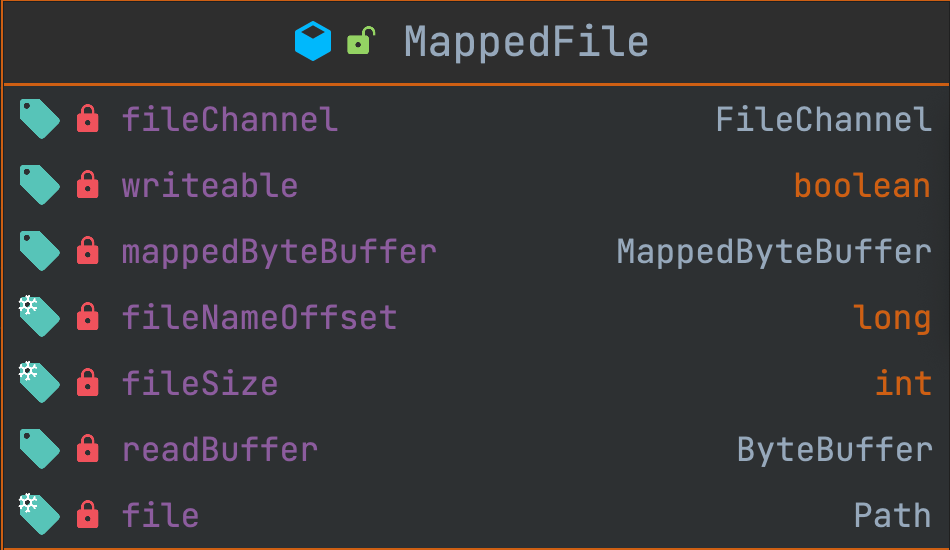

# lamq

看了 rocketmq 的一些设计后，自己动手造一个简单的轮子，目前已经实现了基础的 commitLog 和 indexFile。

### 内存映射
`MappedFile` 内存映射文件

- `mappedByteBuffer` 是文件 `file` 的内存映射文件，用于写

- `readBuffer` 是 `mappedByteBuffer` 的一个视图，为了将读写独立，所以单独负责读

  核心代码可参照 `init`

`MappedFileQueue` 用于组织某一目录下同一类文件，例如索引文件、数据文件等。

提供以下能力：

- 初始化，初始化时加载目录下的文件，并按照顺序组织
- 写入时，自动根据文件大小创建新的文件用于写入
- 读取时，自动根据偏移量计算数据对应的文件，并读出数据

### CommitLog 与 IndexFile

有了以上两个类作为基础，就可以开始设计 `CommiLog` 和 `IndexFile` 了。

`CommitLog` 数据文件，用于存储数据， `IndexFile` 索引文件，存储索引，这两个都是使用 `MappedFileQueue` 来组织文件，利用 `MappedFileQueue` 来对同一类型的单个文件管理，可以让 `CommitLog` 和 `IndexFile` 专注于自身的逻辑。

`CommitLog` 的组织文件内容的方式很简单，

例如：写入两条数据 `a`，`b`，则文件中的记录为`ab`。

即 `CommitLog` 文件的写入，就是简单的追加，没有特殊设计，但在每次写入后，都会返回本次写入的起始偏移量和长度，用于下面的索引。偏移量不仅是在单个文件中的偏移，还包含了文件的偏移（即文件名偏移）。

`IndexFile` 会将写入 `CommitLog` 后返回的偏移量和长度，记录到索引文件，偏移量使用的 `long`，长度使用的是 `int`。

`IndexFile` 和 `CommitLog` 除了记录的文件内容不同外，

`IndexFile` 的每个索引文件会有文件头，`int` 类型，用来记录该文件中索引的总偏移量，例如该索引文件中写入了一条索引记录，则该索引文件的前4个字节 (int) 的值为 12 (long 8 + int 4)。

`CommitLog` 和 `IndexFile` 还有一个区别，即在恢复后切换文件时。如果停机后再次恢复，`CommitLog` 是直接创建一个新的文件用于写入，而不会检查上次最近一次写的文件是否写满，因为 `CommitLog` 的设计没有记录已经写入的长度，所以其也没有能力实现这个。`IndexFile` 由于要考虑到随机检索的问题，因此在停机恢复后，会对上次写的文件进行校验是否写满，如果没有写满会在后续继续写入。

### 对外读写能力

`MessageStore` 是一个对外提供能力的类，内部会通过 `CommitLog` 和 `IndexLog` 来存储并索引数据。

提供数据的写入和随机读取能力。

### 如何使用

运行 `MessageStoreTest`

### 问题

但是现在只会在正常 close 时才会刷盘。没有进行刷盘时，可能会导致已经写入的数据丢失，被读取到的数据没有持久化，丢失了，即读取到脏数据。

